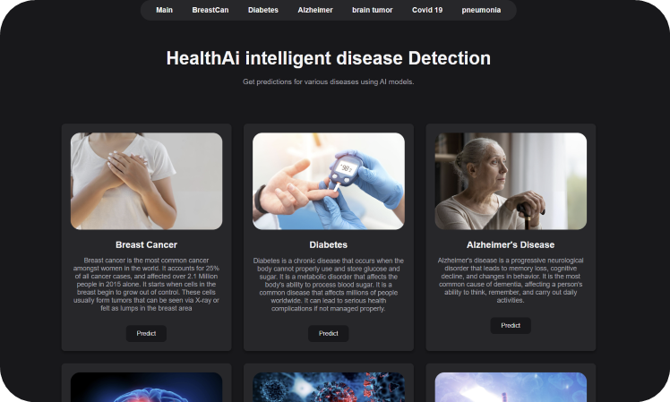
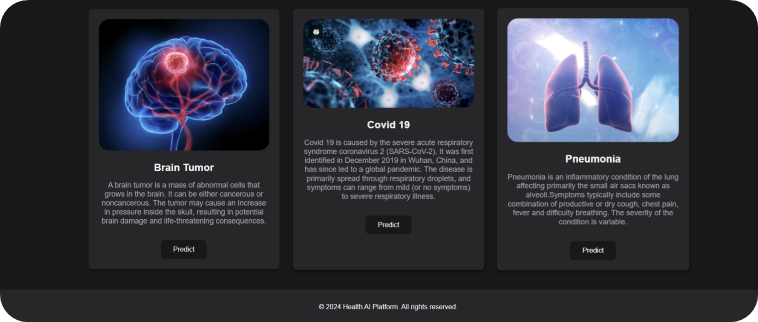
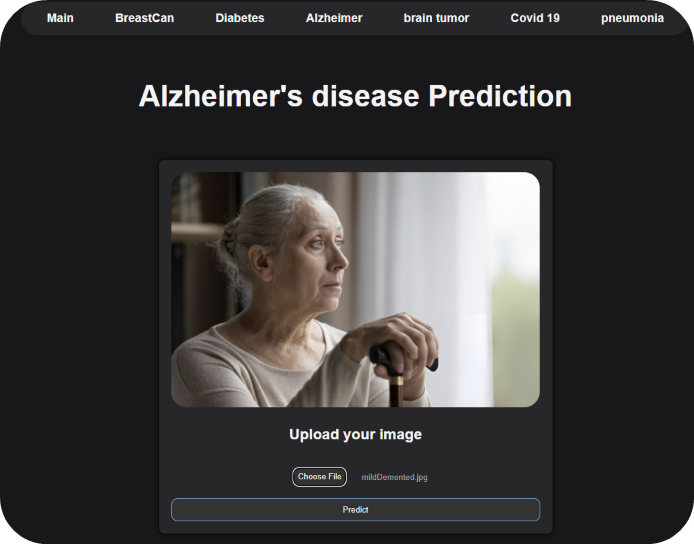
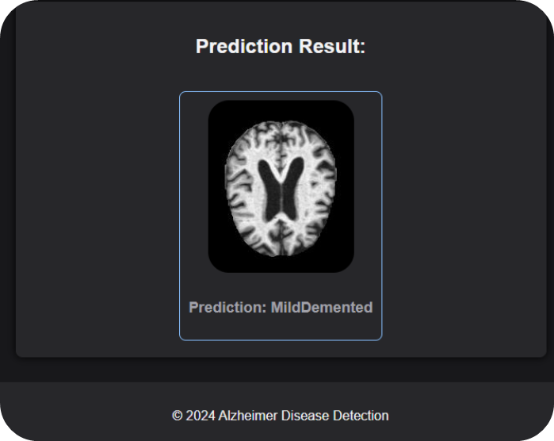
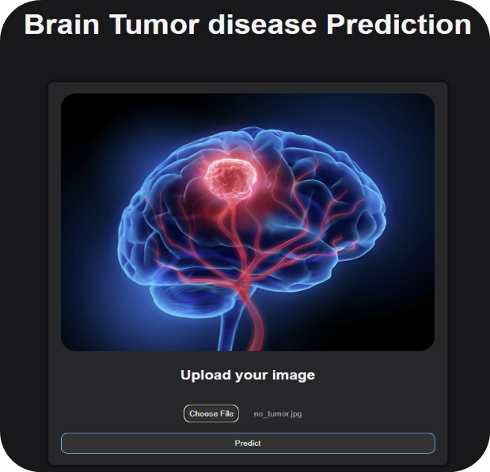
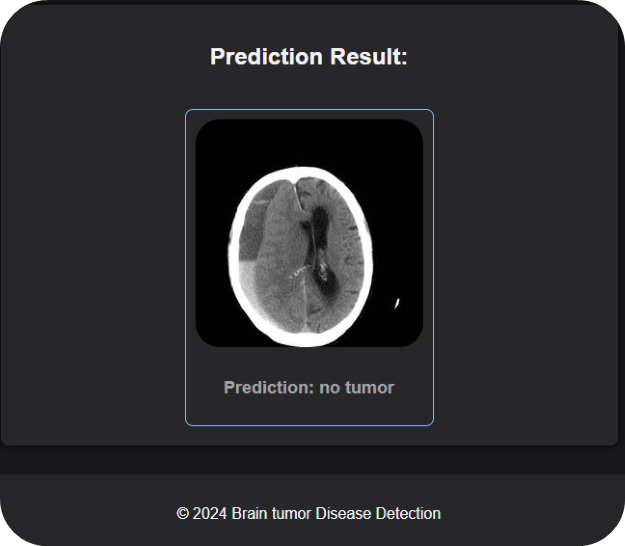
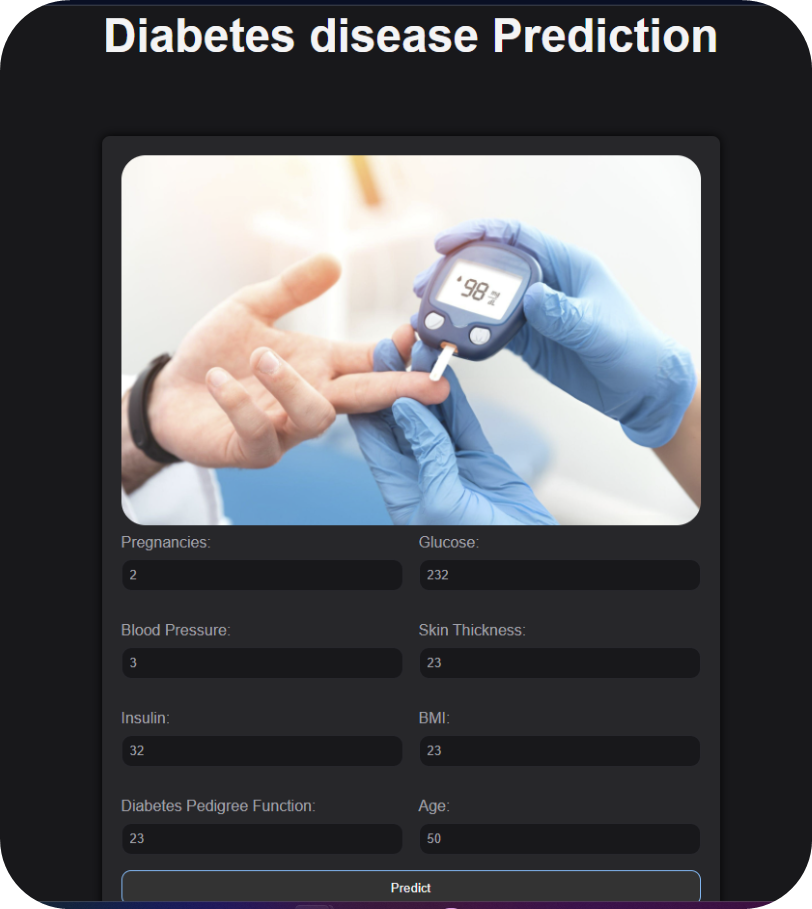
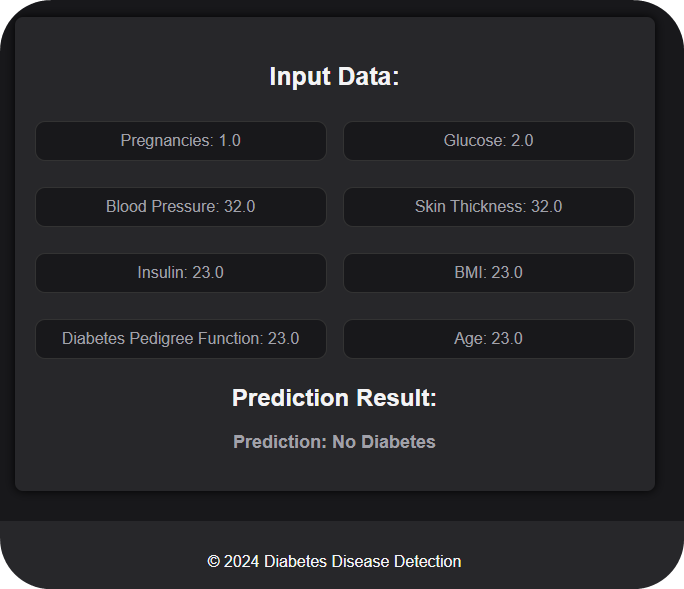
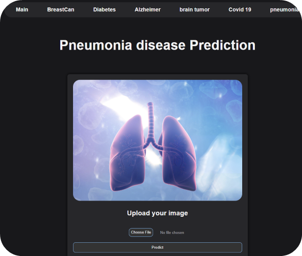
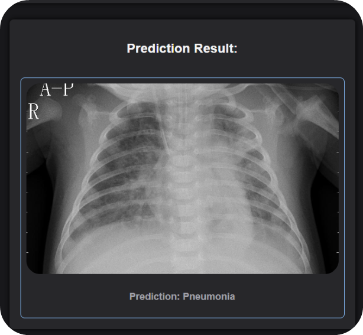

# HealthAI: Intelligent Disease Detection

> Revolutionizing healthcare with AI-powered disease detection

## 📋 Table of Contents
- [Overview](#overview)
- [Key Features](#key-features)
- [Screenshots](#screenshots)
- [Diseases Covered](#diseases-covered)
- [Technology Stack](#technology-stack)
- [Installation and Setup](#installation-and-setup)
- [Usage Guide](#usage-guide)
- [Project Stages](#project-stages)
- [Data Sources](#data-sources)
- [Project Goals](#project-goals)
- [Conclusion](#conclusion)
- [Contributing](#contributing)
- [License](#license)

## 🔍 Overview

HealthAI is an advanced artificial intelligence platform designed to provide quick and accurate diagnosis of major diseases. Our solution leverages deep learning algorithms to analyze medical images and data, enabling rapid disease detection and potentially life-saving early interventions.

AI is revolutionizing healthcare by enhancing diagnostic accuracy, personalizing treatment plans, improving patient outcomes, and optimizing operational efficiency. Our platform addresses critical challenges such as rising healthcare costs, uneven access to care, and the increasing complexity of medical data.

## ✨ Key Features

- **Rapid Disease Detection**: Get preliminary diagnosis within minutes
- **Multi-Disease Support**: Currently supporting 6 major diseases
- **User-Friendly Interface**: Simple upload process for medical images
- **High Accuracy**: State-of-the-art AI models trained on extensive datasets

## 📸 Screenshots

View Application Screenshots

### Home Page

### Alzheimer's Detection

### Brain Tumor Detection

### Diabetes Detection

### Pneumonia Detection

## 🔬 Diseases Covered

Our AI platform currently detects the following diseases:

1. **Brain Tumor** - Analysis of MRI scans
2. **Alzheimer's Disease** - Detection using brain imaging
3. **COVID-19** - Identification from chest X-rays
4. **Pneumonia** - Detection from chest X-rays
5. **Breast Cancer** - Analysis of mammograms and clinical data
6. **Diabetes** - Prediction based on patient data

## 💻 Technology Stack

- **Frontend**: HTML, CSS, JavaScript
- **Backend**: Python, Flask
- **AI/ML**: TensorFlow, Keras
- **Deployment**: AWS EC2
- **Data Processing**: NumPy, Pandas, OpenCV

## 🚀 Installation and Setup

## 🔻Project Stages🔻

1. **Data Collection and Preparation**
2. **Data Understanding**
3. **Modeling**
4. **Evaluation**
5. **Deployment**

### 🔻Data Collection and Preparation🔻

We will gather structured and unstructured data from the mentioned sources and prepare it for modeling.

### 🔻Data Understanding🔻

We will analyze the data using descriptive and predictive statistics to ensure it represents the problem we aim to solve.

### 🔻Modeling🔻

We will test multiple algorithms to find the best models for our classification and prediction tasks.

### 🔻Evaluation🔻

We will evaluate the models using diagnostic measures such as the ROC curve to determine their effectiveness.

### 🔻Deployment🔻

We will deploy the model and gather feedback from stakeholders to refine and improve the system.

## 🔻Data Sources🔻

We will use publicly available datasets for our project:

- [Brain Tumor MRI Dataset](https://www.kaggle.com/datasets/masoudnickparvar/brain-tumor-mri-dataset/data)
- [Alzheimer’s Dataset](https://www.kaggle.com/datasets/tourist55/alzheimers-dataset-4-class-of-images/data)
- [Covid-19 Chest X-ray Dataset](https://www.kaggle.com/datasets/pranavraikokte/covid19-image-dataset)
- [Pneumonia Chest X-ray Dataset](https://www.kaggle.com/datasets/paultimothymooney/chest-xray-pneumonia)
- [Breast Cancer Dataset](https://www.kaggle.com/datasets/yasserh/breast-cancer-dataset)
- [Diabetes Data Set](https://www.kaggle.com/datasets/mathchi/diabetes-data-set)

## 🔻Project Goals🔻

The primary goals of this project are to:

1. **Reduce Diagnostic Delays:** Provide rapid diagnosis to expedite treatment and improve patient outcomes.
2. **Improve Accessibility:** Ensure that individuals can access diagnostic services regardless of their location.
3. **Lower Costs:** Develop a cost-effective diagnostic tool to make healthcare more affordable.
4. **Enhance Accuracy:** Ensure high accuracy in disease detection to minimize the risk of misdiagnosis.

## 🔻Conclusion🔻

This AI healthcare detection project will address critical issues in the medical field, providing faster, more accessible, and accurate diagnoses, ultimately improving patient care and outcomes.
